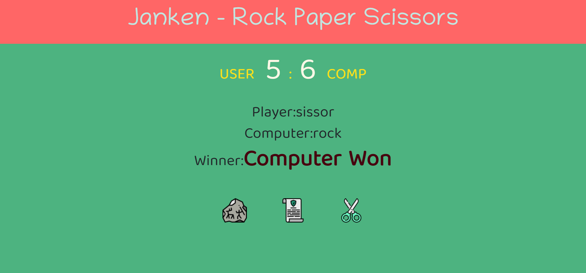

# JavaScript Project - Janken Rock Paper Scissors Game

## **Project: Rock Paper Scissors Game**

### Concepts learned from this project:
- Learned about creating a logic with functions and checking winner of the game using JavaScript.

**Live Link :** [Deployed Link](https://js-project-rockpaperscissors.netlify.app/)
>### Preview :

